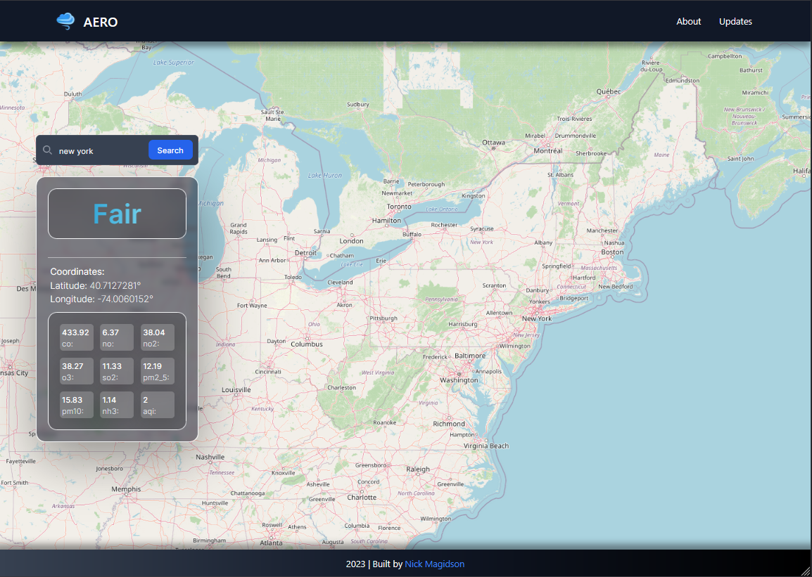

## Aero

Air pollution dashboard web application built with the T3 stack. Wielding OpenWeather API data, geocoding, and search / map functionality.
<br />

[Live Preview](https://aero-dashboard.netlify.app/)

## Key Features

* Real-time Data: The dashboard fetches up-to-date air pollution data from the OpenWeatherMap API based on the user's chosen location.
* AQI Visualization: The dashboard uses a gauge component to visually represent the Air Quality Index (AQI), providing an intuitive understanding of air quality levels.
* Pollutant Components: A data grid displays individual pollutant components, such as CO, NO, NO2, O3, SO2, PM2.5, PM10, and NH3, allowing users to assess the specific air pollutants present.
* Location Search: Users can search for air pollution data by entering a city of town name using the integrated search bar.
* Map functionality: Allows the user to view a map and pin to a location on search input. Animated panning is implemented for a nice user experience.


## Tools

This software uses the following tools and open source packages:

- [TypeScript](https://www.typescriptlang.org/)
- [Tailwind CSS](https://tailwindcss.com/)
- [Next.js](https://nextjs.org/)
- [React](https://react.dev/)
- [OpenWeather API](https://openweathermap.org/)
- [React Gauge Component](https://github.com/antoniolago/react-gauge-component)
- [Leaflet](https://leafletjs.com/)
- [Axios](https://axios-http.com/)

## How To Use
```bash
# Clone this repository
$ git clone git@github.com:NickMagidson/aero.git

# Go into the repository
$ cd aero

# Install dependencies
$ npm install

# Run the app
$ npm start
```
